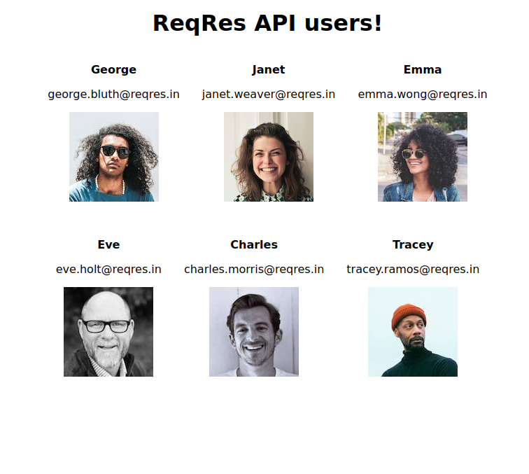

## Fetch API  Assignment
Create a webpage to show the users from a given API [reqres](https://reqres.in/). In the webpage you should   retrieve a list of  users similar to this : 




- you should  fetch from this url : `https://reqres.in/api/users/`
- the result of fetch will be an object : 
```js
{
    "page": 2,
    "per_page": 6,
    "total": 12,
    "total_pages": 2,
    "data": [
        {
            "id": 7,
            "email": "michael.lawson@reqres.in",
            "first_name": "Michael",
            "last_name": "Lawson",
            "avatar": "https://reqres.in/img/faces/7-image.jpg"
        },
        {
            "id": 8,
            "email": "lindsay.ferguson@reqres.in",
            "first_name": "Lindsay",
            "last_name": "Ferguson",
            "avatar": "https://reqres.in/img/faces/8-image.jpg"
        },
        {
            "id": 9,
            "email": "tobias.funke@reqres.in",
            "first_name": "Tobias",
            "last_name": "Funke",
            "avatar": "https://reqres.in/img/faces/9-image.jpg"
        },
        {
            "id": 10,
            "email": "byron.fields@reqres.in",
            "first_name": "Byron",
            "last_name": "Fields",
            "avatar": "https://reqres.in/img/faces/10-image.jpg"
        },
        {
            "id": 11,
            "email": "george.edwards@reqres.in",
            "first_name": "George",
            "last_name": "Edwards",
            "avatar": "https://reqres.in/img/faces/11-image.jpg"
        },
        {
            "id": 12,
            "email": "rachel.howell@reqres.in",
            "first_name": "Rachel",
            "last_name": "Howell",
            "avatar": "https://reqres.in/img/faces/12-image.jpg"
        }
    ],
    "support": {
        "url": "[https://reqres.in/#support-heading](https://reqres.in/#support-heading)",
        "text": "To keep ReqRes free, contributions towards server costs are appreciated!"
    }
}
```
- you have to work with data array to loop and render it to HTML.
- you can use `async` `await`   or you can use`then`
- you can style the html as you want (bootstrap or pure css)